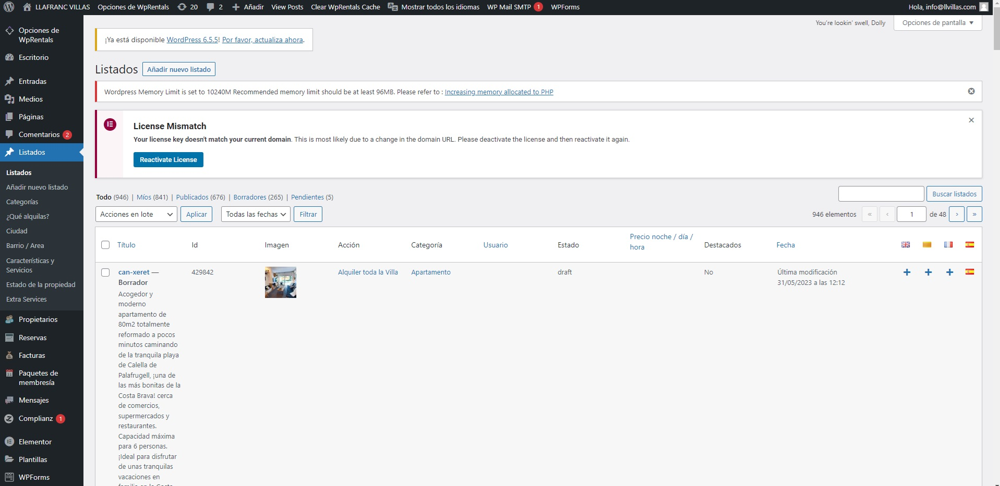
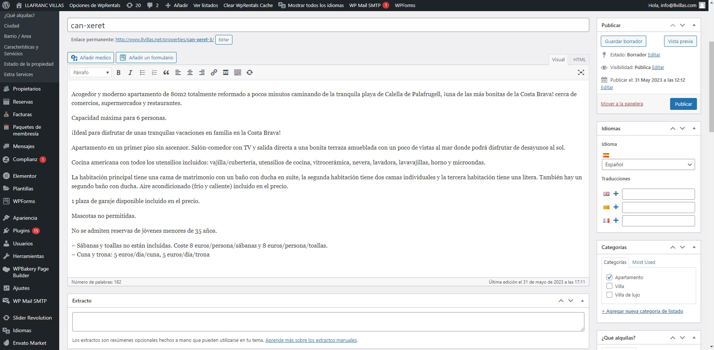
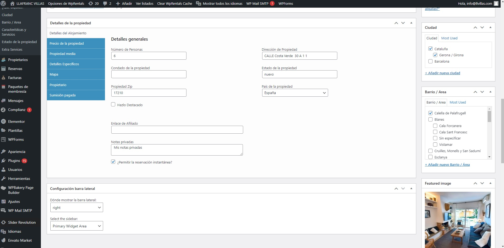
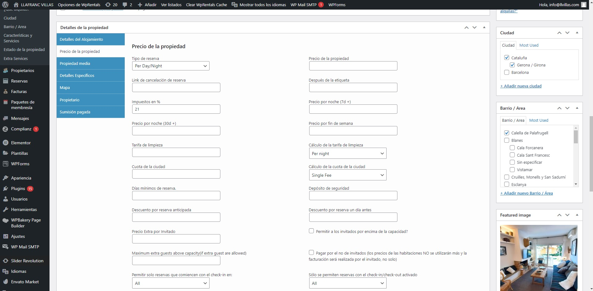
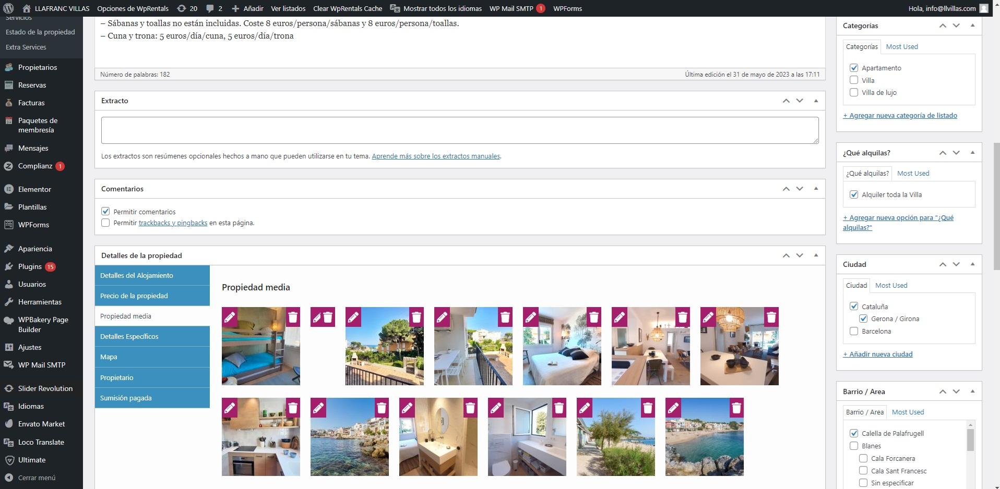
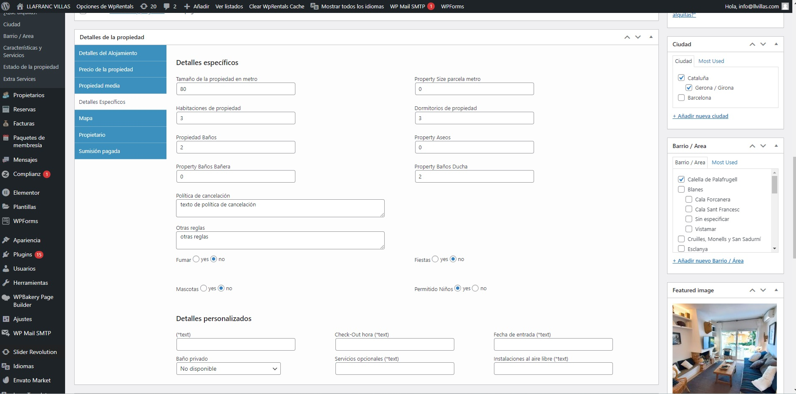
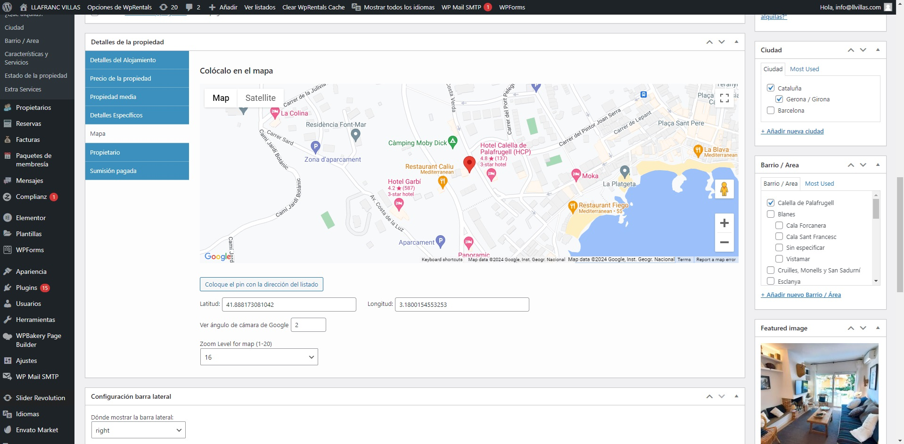
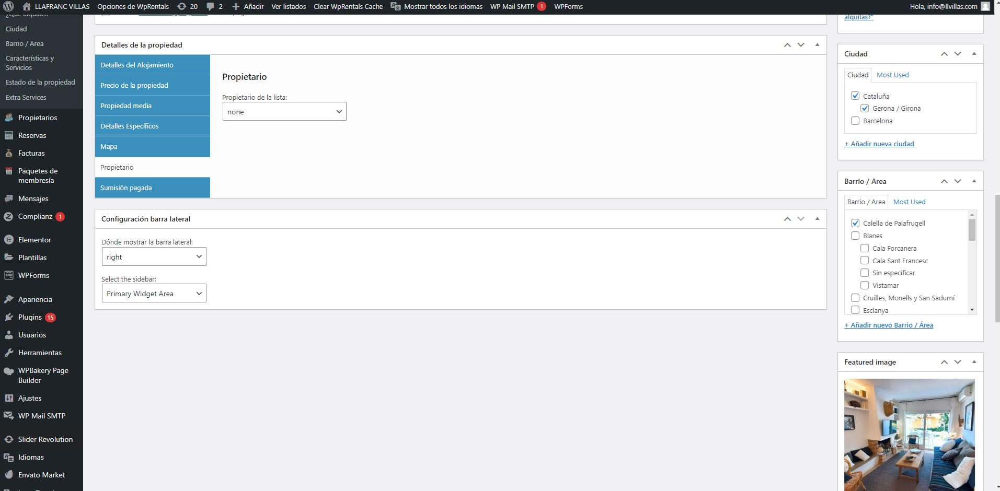
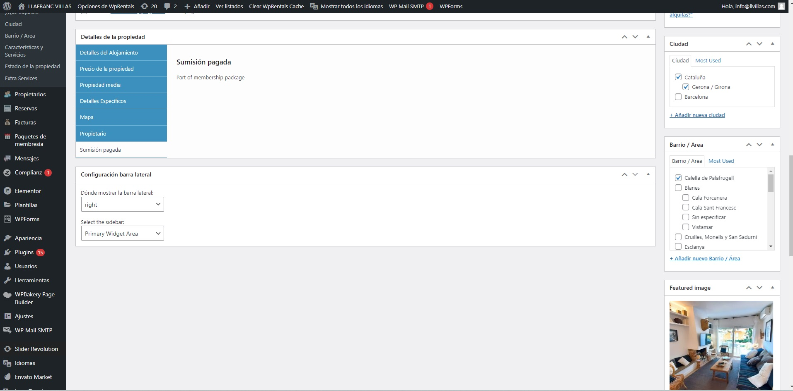

# WP Rentals — Avantio WebService Sync

Plugin de WordPress que sincroniza automáticamente las propiedades desde el **PMS de [Avantio](https://www.avantio.com/es/)** hacia el tema **[WP Rentals](https://wprentals.org/)** mediante CronJobs y consumo de WebServices. El plugin lee los datos de propiedades, precios, disponibilidad, imágenes y características desde la API de Avantio y los importa/actualiza como Custom Post Types (`estate_property`) en WordPress.

[](https://wordpress.org/)
[](https://www.php.net/)
[](https://wprentals.org/)
[](https://www.avantio.com/es/)
[](LICENSE)

---

## Tabla de Contenidos

- [Sobre el Proyecto](#sobre-el-proyecto)
- [¿Qué es Avantio?](#qué-es-avantio)
- [¿Cómo Funciona?](#cómo-funciona)
- [Estructura del Plugin](#estructura-del-plugin)
- [Capturas de Pantalla](#capturas-de-pantalla)
- [Datos Sincronizados](#datos-sincronizados)
- [Requisitos](#requisitos)
- [Instalación](#instalación)
- [Configuración](#configuración)
- [Recursos](#recursos)
- [Autor](#autor)

---

## Sobre el Proyecto

Las agencias de alquiler vacacional gestionan sus propiedades en un **PMS** (Property Management System) centralizado como Avantio, que se encarga de la distribución en OTAs (Airbnb, Booking.com, Vrbo, etc.), la gestión de reservas, precios y disponibilidad. Sin embargo, el sitio web propio de la agencia (construido con WordPress + WP Rentals) necesita estar sincronizado con esos datos en tiempo real.

Este plugin resuelve ese problema: **consume los WebServices de Avantio mediante tareas programadas (CronJobs)** y actualiza automáticamente todas las propiedades en WP Rentals, eliminando la necesidad de introducir datos manualmente y evitando inconsistencias entre el PMS y la web.

---

## ¿Qué es Avantio?

[Avantio](https://www.avantio.com/es/) es un software de gestión de alquiler vacacional todo-en-uno con más de 20 años en el sector. Ofrece PMS (Property Management System), Channel Manager (conexión con +60 OTAs), motor de reservas directas, y APIs para integración con sistemas externos.

**Funcionalidades clave de Avantio:**

- Gestión centralizada de propiedades (descripciones, fotos, precios, disponibilidad)
- Channel Manager con sincronización en tiempo real con Airbnb, Booking.com, Vrbo, Expedia, etc.
- Motor de reservas directas y gestión de pagos
- API / WebServices para integración con webs y aplicaciones externas
- Gestión de propietarios, comunicación con huéspedes, reporting financiero
- Soporte multiidioma y multi-moneda

---

## ¿Cómo Funciona?

El plugin actúa como un puente entre Avantio y WP Rentals:

```
┌─────────────────────┐         ┌──────────────────────────┐         ┌─────────────────────┐
│                     │         │                          │         │                     │
│   Avantio PMS       │◄───────►│   Plugin WP Rentals      │────────►│   WordPress         │
│                     │  SOAP/  │   WS Avantio             │  WP     │   WP Rentals Theme  │
│  • Propiedades      │  REST   │                          │  API    │                     │
│  • Precios          │  API    │  • CronJob programado    │         │  • estate_property  │
│  • Disponibilidad   │         │  • Controllers           │         │  • Taxonomías       │
│  • Imágenes         │         │  • Models                │         │  • Custom Fields    │
│  • Características  │         │  • Helpers               │         │  • Imágenes         │
│  • Ubicaciones      │         │  • Clases de mapeo       │         │  • Mapas            │
│                     │         │                          │         │                     │
└─────────────────────┘         └──────────────────────────┘         └─────────────────────┘
```

### Flujo de Sincronización

```
1. WordPress CronJob se ejecuta (periódicamente)
       │
       ▼
2. El plugin llama a los WebServices de Avantio
   ├── Obtener listado de propiedades
   ├── Obtener detalles de cada propiedad
   ├── Obtener precios y disponibilidad
   ├── Obtener imágenes
   └── Obtener características y amenities
       │
       ▼
3. Los Models mapean los datos de Avantio a WP Rentals
   ├── Mapeo de campos personalizados (custom fields)
   ├── Mapeo de taxonomías (categoría, área, ciudad)
   ├── Descarga y asignación de imágenes
   └── Geolocalización (latitud, longitud)
       │
       ▼
4. Los Controllers crean/actualizan los posts en WordPress
   ├── Crear nuevo estate_property si no existe
   ├── Actualizar datos si la propiedad ya existe
   ├── Asignar taxonomías (property_category, property_area)
   └── Actualizar meta fields y galería de imágenes
```

---

## Estructura del Plugin

```
wprentals-ws-avantio/
├── wprentals-ws-avantio.php    # Archivo principal del plugin (bootstrap, hooks, cron)
├── Clases/                     # Clases PHP para consumo del WebService de Avantio
│   └── ...                     # Clientes SOAP/REST, parsers de respuesta
├── Controllers/                # Controladores de sincronización
│   └── ...                     # Lógica de creación/actualización de propiedades
├── Models/                     # Modelos de datos
│   └── ...                     # Mapeo Avantio → WP Rentals (CPT, meta fields, taxonomías)
├── Helpers/                    # Funciones auxiliares
│   └── ...                     # Utilidades, formateo, validación
├── bg/                         # Capturas de pantalla del plugin
│   ├── listado.jpg
│   ├── detalle_1.jpg
│   ├── detalle_2.jpg
│   ├── ...
│   └── detalle_8.jpg
├── .gitignore
├── LICENSE                     # GPL-3.0
└── README.md
```

### Patrón de Arquitectura

El plugin sigue un patrón **MVC simplificado**:

| Capa | Carpeta | Responsabilidad |
|---|---|---|
| **Clases** | `Clases/` | Consumo de WebServices de Avantio (clientes SOAP/REST, parsing de XML/JSON) |
| **Models** | `Models/` | Mapeo de datos entre Avantio y WP Rentals (campos, taxonomías, imágenes) |
| **Controllers** | `Controllers/` | Orquestación de la sincronización (crear, actualizar, eliminar propiedades) |
| **Helpers** | `Helpers/` | Funciones auxiliares (formateo de precios, sanitización, logs) |

---

## Capturas de Pantalla

### Listado de Propiedades — Custom Post Type y Taxonomías

Vista del listado de propiedades (`estate_property`) sincronizadas desde Avantio en el panel de administración de WordPress:



---

### Detalle de Propiedad — Custom Fields y Taxonomías

Fichas de propiedad con todos los campos personalizados importados desde Avantio:

<table>
  <tr>
    <td></td>
    <td></td>
  </tr>
  <tr>
    <td></td>
    <td></td>
  </tr>
  <tr>
    <td></td>
    <td></td>
  </tr>
  <tr>
    <td></td>
    <td></td>
  </tr>
</table>

---

## Datos Sincronizados

El plugin sincroniza los siguientes datos desde Avantio hacia WP Rentals:

### Información de la Propiedad

| Campo Avantio | Campo WP Rentals | Tipo |
|---|---|---|
| Nombre / Título | `post_title` | Post field |
| Descripción | `post_content` | Post field |
| Referencia Avantio | Custom meta field | Meta |
| Tipo de propiedad | `property_category` | Taxonomía |
| Área / Zona | `property_area` | Taxonomía |
| Ciudad | `property_city` | Taxonomía |
| Dirección | `property_address` | Meta |
| Latitud | `property_latitude` | Meta |
| Longitud | `property_longitude` | Meta |
| Nº habitaciones | `property_bedrooms` | Meta |
| Nº baños | `property_bathrooms` | Meta |
| Capacidad (huéspedes) | `guest_no` | Meta |
| Superficie (m²) | `property_size` | Meta |

### Precios y Disponibilidad

| Campo Avantio | Campo WP Rentals | Tipo |
|---|---|---|
| Precio por noche | `property_price` | Meta |
| Precios estacionales | Custom pricing rules | Meta |
| Calendario de disponibilidad | Availability calendar | Meta |
| Estancia mínima | `min_days_booking` | Meta |

### Media

| Campo Avantio | Campo WP Rentals | Tipo |
|---|---|---|
| Imágenes de la propiedad | Galería del post / Featured image | Attachment |

### Características / Amenities

| Campo Avantio | Campo WP Rentals | Tipo |
|---|---|---|
| Amenities (piscina, WiFi, A/C...) | `property_features` | Taxonomía |

---

## Requisitos

- **WordPress** 5.x / 6.x
- **PHP** >= 7.4 (con extensiones `soap` y `curl` habilitadas)
- **Tema WP Rentals** instalado y activo — [wprentals.org](https://wprentals.org/)
- **Credenciales de Avantio** (API key / usuario y contraseña del WebService)
- **WP-Cron** habilitado (o cron del sistema configurado)

---

## Instalación

### Paso 1: Instalar el Plugin

```bash
# Clonar el repositorio
git clone https://github.com/david-berruezo/wprentals-ws-avantio.git

# Copiar al directorio de plugins de WordPress
cp -r wprentals-ws-avantio /var/www/html/wordpress/wp-content/plugins/

# Establecer permisos
chmod -R 755 /var/www/html/wordpress/wp-content/plugins/wprentals-ws-avantio
chown -R www-data:www-data /var/www/html/wordpress/wp-content/plugins/wprentals-ws-avantio
```

### Paso 2: Activar el Plugin

1. Ir a **Plugins > Plugins instalados** en el panel de administración
2. Buscar **WP Rentals WS Avantio**
3. Clic en **Activar**

### Paso 3: Configurar las Credenciales de Avantio

Configurar las credenciales de acceso al WebService de Avantio en los ajustes del plugin o directamente en el archivo de configuración.

### Paso 4: Verificar la Extensión SOAP de PHP

```bash
# Comprobar que la extensión SOAP está habilitada
php -m | grep soap

# Si no está instalada
sudo apt-get install php-soap
sudo systemctl restart apache2
```

---

## Configuración

### CronJob

El plugin registra un evento de WordPress Cron que se ejecuta periódicamente para sincronizar los datos. Para un mayor control, se recomienda desactivar WP-Cron nativo y configurar un cron real del sistema:

```bash
# Desactivar WP-Cron nativo (añadir a wp-config.php)
define('DISABLE_WP_CRON', true);

# Configurar cron del sistema (ejecutar cada hora)
crontab -e
0 * * * * wget -q -O - https://tu-dominio.com/wp-cron.php?doing_wp_cron > /dev/null 2>&1
```

### Mapeo de Campos

El plugin mapea automáticamente los campos de Avantio a los custom fields de WP Rentals. Los **Models** contienen la lógica de mapeo que puede ajustarse según las necesidades del proyecto.

---

## Recursos

### Avantio

- [Avantio — Sitio oficial](https://www.avantio.com/es/)
- [Avantio — API Integrations](https://www.avantio.com/api-integrations/)
- [Avantio — Documentación](https://www.avantio.com/blog/avantio-api-integrations/)

### WP Rentals

- [WP Rentals — Sitio oficial](https://wprentals.org/)
- [WP Rentals — Help Center](https://help.wprentals.org/)
- [WP Rentals — ThemeForest](https://themeforest.net/item/wp-rentals-booking-accommodation-wordpress-theme/12921802)

### WordPress Development

- [WordPress Plugin Handbook](https://developer.wordpress.org/plugins/)
- [WP-Cron — Scheduling Events](https://developer.wordpress.org/plugins/cron/)
- [Custom Post Types](https://developer.wordpress.org/plugins/post-types/)
- [PHP SOAP Client](https://www.php.net/manual/en/class.soapclient.php)

### Repositorios Relacionados

- [llafranc-villas](https://github.com/david-berruezo/llafranc-villas) — Child-theme de WP Rentals para [llvillas.com](https://www.llvillas.com/)
- [wp-rentals-theme-modified](https://github.com/david-berruezo/wp-rentals-theme-modified) — Tema WP Rentals modificado

---

## Autor

**David Berruezo** — Software Engineer | Fullstack Developer

- GitHub: [@david-berruezo](https://github.com/david-berruezo)
- Website: [davidberruezo.com](https://www.davidberruezo.com)

---

## Licencia

Este proyecto está licenciado bajo **GPL-3.0**. Consulta el archivo [LICENSE](LICENSE) para más detalles.
